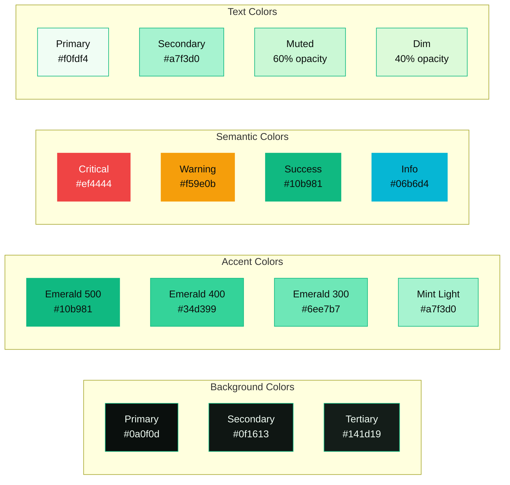

# FRA Diagnostic App - Frontend Redesign Plan

## Executive Summary

Complete frontend redesign transforming the current generic UI into a **Premium Dashboard** aesthetic with **dark glassmorphism**, **emerald/mint accent colors**, and **high-end analytics feel** with depth through layering.

---

## Visual Layout Diagrams

### Application Layout Structure

```mermaid
graph TB
    subgraph AppShell[Application Shell - Dark Background with Gradient Mesh]
        subgraph Sidebar[Glass Sidebar - 280px Fixed]
            Logo[Logo + Brand<br/>Emerald Glow]
            Nav[Navigation Items<br/>Glass Highlight Active]
            Footer[Settings + Version]
        end
        
        subgraph MainContent[Main Content Area - Scrollable]
            Header[Page Header<br/>Title + Actions]
            Content[Page Content<br/>Glass Cards Grid]
        end
    end
    
    Logo --> Nav
    Nav --> Footer
    Header --> Content
    
    style AppShell fill:#0a0f0d,stroke:#10b981,stroke-width:2px
    style Sidebar fill:#0f1613,stroke:#10b98133
    style MainContent fill:#141d19,stroke:#10b98133
    style Logo fill:#10b981,stroke:#10b981
    style Nav fill:#141d19,stroke:#10b98155
    style Header fill:#141d19,stroke:#10b98155
    style Content fill:#141d19,stroke:#10b98155
```



### Dashboard Page Layout

```mermaid
graph TB
    subgraph DashboardPage[Dashboard Page]
        subgraph StatsRow[Summary Stats Row - 4 Columns]
            Card1[Total Transformers<br/>Glass Card + Icon]
            Card2[Measurements<br/>Glass Card + Icon]
            Card3[Critical Assets<br/>Glass Card + Icon]
            Card4[Analyses Run<br/>Glass Card + Icon]
        end
        
        subgraph MainSection[Main Content Section]
            subgraph TableSection[Fleet Table - 70% Width]
                TableHeader[Table Header<br/>Title + View All Link]
                TableBody[Data Rows<br/>Hover Glow Effect]
            end
            
            subgraph QuickPanel[Quick Panel - 30% Width]
                HealthRing[System Health<br/>Animated Ring]
                RecentActivity[Recent Activity<br/>Feed List]
            end
        end
    end
    
    Card1 --- Card2
    Card2 --- Card3
    Card3 --- Card4
    
    TableHeader --> TableBody
    HealthRing --> RecentActivity
    
    style DashboardPage fill:#0a0f0d,stroke:#10b981
    style StatsRow fill:#141d19,stroke:#10b98133
    style Card1 fill:#141d1999,stroke:#10b98155
    style Card2 fill:#141d1999,stroke:#10b98155
    style Card3 fill:#141d1999,stroke:#10b98155
    style Card4 fill:#141d1999,stroke:#10b98155
    style TableSection fill:#141d1999,stroke:#10b98155
    style QuickPanel fill:#141d1999,stroke:#10b98155
```



### Component Hierarchy

```mermaid
graph TD
    App[App.tsx] --> Layout[Layout.tsx]
    Layout --> Sidebar[Sidebar.tsx<br/>Glass Effect]
    Layout --> Outlet[Page Outlet]
    
    Outlet --> Dashboard[Dashboard.tsx]
    Outlet --> Transformers[TransformersPage.tsx]
    Outlet --> Detail[TransformerDetail.tsx]
    Outlet --> Import[ImportPage.tsx]
    Outlet --> Analysis[AnalysisPage.tsx]
    Outlet --> Recommendations[RecommendationsPage.tsx]
    
    subgraph SharedComponents[Shared UI Components]
        GlassCard[GlassCard]
        Button[Button Variants]
        Badge[Status Badge]
        Table[DataTable]
        Input[Form Inputs]
        Chart[FRAChart]
    end
    
    Dashboard --> GlassCard
    Dashboard --> Badge
    Dashboard --> Table
    
    Transformers --> GlassCard
    Transformers --> Badge
    Transformers --> Input
    
    Detail --> GlassCard
    Detail --> Chart
    Detail --> Table
    
    Import --> GlassCard
    Import --> Input
    Import --> Button
    
    style App fill:#10b981,stroke:#10b981
    style Layout fill:#059669,stroke:#10b981
    style Sidebar fill:#047857,stroke:#10b981
    style SharedComponents fill:#141d19,stroke:#10b98155
```



### Transformer Detail Page Layout

```mermaid
graph TB
    subgraph DetailPage[Transformer Detail Page]
        subgraph HeroSection[Hero Section]
            BackBtn[Back Arrow]
            TitleBlock[Name + Location<br/>Large Typography]
        end
        
        subgraph InfoCards[Info Cards Row - 4 Columns]
            Voltage[Voltage<br/>132 kV]
            Power[Power<br/>100 MVA]
            Manufacturer[Manufacturer<br/>ABB]
            Criticality[Criticality<br/>Badge]
        end
        
        subgraph ChartSection[FRA Chart Section - Full Width]
            ChartHeader[Chart Title + Controls]
            PlotlyChart[Plotly Chart<br/>Dark Theme<br/>Emerald Line]
            ChartMeta[Metadata Bar]
        end
        
        subgraph MeasurementsTable[Measurements History]
            MTableHeader[Table Header + Upload Button]
            MTableBody[Measurement Rows<br/>View Curve Actions]
        end
    end
    
    BackBtn --- TitleBlock
    Voltage --- Power
    Power --- Manufacturer
    Manufacturer --- Criticality
    ChartHeader --> PlotlyChart
    PlotlyChart --> ChartMeta
    MTableHeader --> MTableBody
    
    style DetailPage fill:#0a0f0d,stroke:#10b981
    style HeroSection fill:#141d19,stroke:#10b98133
    style InfoCards fill:#141d19,stroke:#10b98133
    style ChartSection fill:#141d1999,stroke:#10b98155
    style MeasurementsTable fill:#141d1999,stroke:#10b98155
    style PlotlyChart fill:#0a0f0d,stroke:#10b981
```



### Import Page Layout

```mermaid
graph TB
    subgraph ImportPage[Import FRA Data Page]
        subgraph LeftColumn[Upload Section - 2/3 Width]
            subgraph DropZone[Drag and Drop Zone]
                UploadIcon[Upload Icon<br/>Animated]
                DropText[Drop files here<br/>or click to browse]
                FileTypes[Supported formats]
            end
            
            subgraph FormFields[Upload Form]
                TransformerSelect[Transformer Selector]
                WindingConfig[Winding Configuration]
                DateField[Measurement Date]
                TempField[Temperature]
                NotesField[Notes]
            end
            
            UploadBtn[Upload Button<br/>Emerald Gradient]
        end
        
        subgraph RightColumn[Status Section - 1/3 Width]
            StatusCard[Upload Status<br/>Progress + Result]
        end
        
        subgraph HistorySection[Import History Table - Full Width]
            HistoryHeader[History Header + Refresh]
            HistoryRows[History Rows<br/>Status Icons]
        end
    end
    
    UploadIcon --> DropText
    DropText --> FileTypes
    TransformerSelect --> WindingConfig
    WindingConfig --> DateField
    DateField --> TempField
    TempField --> NotesField
    NotesField --> UploadBtn
    HistoryHeader --> HistoryRows
    
    style ImportPage fill:#0a0f0d,stroke:#10b981
    style DropZone fill:#141d19,stroke:#10b981,stroke-dasharray:5 5
    style FormFields fill:#141d1999,stroke:#10b98155
    style StatusCard fill:#141d1999,stroke:#10b98155
    style HistorySection fill:#141d1999,stroke:#10b98155
    style UploadBtn fill:#10b981,stroke:#10b981
```



### Glass Card Component States

```mermaid
stateDiagram-v2
    [*] --> Default: Initial Render
    Default --> Hover: Mouse Enter
    Hover --> Default: Mouse Leave
    Hover --> Active: Click/Press
    Active --> Default: Release
    Default --> Focus: Tab Focus
    Focus --> Default: Blur
    
    state Default {
        note right of Default
            Background: rgba 20 29 25 0.7
            Border: rgba 16 185 129 0.15
            Shadow: Standard
        end note
    }
    
    state Hover {
        note right of Hover
            Border: rgba 16 185 129 0.3
            Shadow: Glow effect
            Transform: translateY -2px
        end note
    }
    
    state Active {
        note right of Active
            Transform: scale 0.98
            Shadow: Reduced
        end note
    }
    
    state Focus {
        note right of Focus
            Ring: 2px emerald
            Outline offset: 2px
        end note
    }
```

### Color System Visual



---

## Current State Analysis

### Issues Identified

| Category | Current State | Problem |
|----------|--------------|---------|
| **Typography** | Inter, Segoe UI, system fonts | Generic, overused AI-aesthetic fonts |
| **Color Scheme** | Slate-900 sidebar, gray-50 background, blue-600 accents | Standard Tailwind defaults, no personality |
| **Theme** | Light theme with dark sidebar | Inconsistent, lacks premium feel |
| **Components** | Basic rounded cards with subtle shadows | Cookie-cutter, no depth or visual interest |
| **Layout** | Standard sidebar + content | Predictable, no visual hierarchy innovation |
| **Animations** | Minimal - only loading spinners | Static, lacks polish and delight |
| **Visual Effects** | None | No glassmorphism, gradients, or texture |

### Files Requiring Updates

```
frontend/
├── index.html                    # Add Google Fonts
├── src/
│   ├── index.css                 # Complete theme overhaul
│   ├── App.css                   # Remove legacy Vite styles
│   ├── components/
│   │   ├── Layout.tsx            # New layout with effects
│   │   ├── Sidebar.tsx           # Glassmorphic sidebar
│   │   └── [new components]      # Reusable UI components
│   └── pages/
│       ├── Dashboard.tsx         # Premium dashboard cards
│       ├── TransformersPage.tsx  # Enhanced grid cards
│       ├── TransformerDetail.tsx # Refined detail view
│       ├── ImportPage.tsx        # Polished upload UI
│       ├── AnalysisPage.tsx      # Analytics styling
│       └── RecommendationsPage.tsx # Matrix redesign
```

---

## New Design System

### Aesthetic Direction: Premium Dark Glassmorphism

A sophisticated dark theme with translucent glass-like surfaces, emerald/mint accents, and layered depth creating a high-end analytics dashboard experience.

### Color Palette

```css
:root {
  /* ═══ BASE COLORS ═══ */
  --bg-primary: #0a0f0d;           /* Deep dark green-black */
  --bg-secondary: #0f1613;         /* Slightly lighter */
  --bg-tertiary: #141d19;          /* Card backgrounds */
  
  /* ═══ SURFACE COLORS - Glassmorphism ═══ */
  --glass-bg: rgba(20, 29, 25, 0.7);
  --glass-border: rgba(16, 185, 129, 0.15);
  --glass-highlight: rgba(255, 255, 255, 0.05);
  
  /* ═══ PRIMARY ACCENT - Emerald ═══ */
  --emerald-50: #ecfdf5;
  --emerald-100: #d1fae5;
  --emerald-200: #a7f3d0;
  --emerald-300: #6ee7b7;
  --emerald-400: #34d399;
  --emerald-500: #10b981;           /* Primary accent */
  --emerald-600: #059669;
  --emerald-700: #047857;
  --emerald-800: #065f46;
  --emerald-900: #064e3b;
  
  /* ═══ SECONDARY ACCENT - Mint ═══ */
  --mint-light: #a7f3d0;
  --mint-glow: rgba(167, 243, 208, 0.3);
  
  /* ═══ TEXT COLORS ═══ */
  --text-primary: #f0fdf4;          /* Near white with green tint */
  --text-secondary: #a7f3d0;        /* Mint for secondary */
  --text-muted: rgba(167, 243, 208, 0.6);
  --text-dim: rgba(167, 243, 208, 0.4);
  
  /* ═══ SEMANTIC COLORS ═══ */
  --status-critical: #ef4444;
  --status-critical-bg: rgba(239, 68, 68, 0.15);
  --status-warning: #f59e0b;
  --status-warning-bg: rgba(245, 158, 11, 0.15);
  --status-success: #10b981;
  --status-success-bg: rgba(16, 185, 129, 0.15);
  --status-info: #06b6d4;
  --status-info-bg: rgba(6, 182, 212, 0.15);
  
  /* ═══ GRADIENTS ═══ */
  --gradient-emerald: linear-gradient(135deg, #10b981 0%, #059669 100%);
  --gradient-glow: linear-gradient(135deg, rgba(16, 185, 129, 0.2) 0%, rgba(6, 182, 212, 0.1) 100%);
  --gradient-surface: linear-gradient(180deg, rgba(255,255,255,0.05) 0%, rgba(255,255,255,0) 100%);
  
  /* ═══ SHADOWS ═══ */
  --shadow-sm: 0 2px 8px rgba(0, 0, 0, 0.3);
  --shadow-md: 0 4px 16px rgba(0, 0, 0, 0.4);
  --shadow-lg: 0 8px 32px rgba(0, 0, 0, 0.5);
  --shadow-glow: 0 0 20px rgba(16, 185, 129, 0.3);
  --shadow-glow-intense: 0 0 40px rgba(16, 185, 129, 0.5);
}
```

### Typography

**Font Selection:**
- **Display/Headings:** `Outfit` - Modern geometric sans-serif with character
- **Body/UI:** `Plus Jakarta Sans` - Clean, readable, slightly rounded
- **Monospace/Data:** `JetBrains Mono` - Technical data display

```css
/* Typography Scale */
--font-display: 'Outfit', sans-serif;
--font-body: 'Plus Jakarta Sans', sans-serif;
--font-mono: 'JetBrains Mono', monospace;

/* Font Sizes */
--text-xs: 0.75rem;      /* 12px */
--text-sm: 0.875rem;     /* 14px */
--text-base: 1rem;       /* 16px */
--text-lg: 1.125rem;     /* 18px */
--text-xl: 1.25rem;      /* 20px */
--text-2xl: 1.5rem;      /* 24px */
--text-3xl: 1.875rem;    /* 30px */
--text-4xl: 2.25rem;     /* 36px */

/* Font Weights */
--font-normal: 400;
--font-medium: 500;
--font-semibold: 600;
--font-bold: 700;

/* Letter Spacing */
--tracking-tight: -0.025em;
--tracking-normal: 0;
--tracking-wide: 0.025em;
--tracking-wider: 0.05em;
```

### Glassmorphism Effects

```css
/* Glass Card Base */
.glass-card {
  background: var(--glass-bg);
  backdrop-filter: blur(12px);
  -webkit-backdrop-filter: blur(12px);
  border: 1px solid var(--glass-border);
  border-radius: 16px;
  box-shadow: var(--shadow-md);
}

/* Glass Card with Glow */
.glass-card-glow {
  background: var(--glass-bg);
  backdrop-filter: blur(12px);
  border: 1px solid var(--glass-border);
  border-radius: 16px;
  box-shadow: 
    var(--shadow-md),
    inset 0 1px 0 var(--glass-highlight);
  transition: all 0.3s ease;
}

.glass-card-glow:hover {
  border-color: rgba(16, 185, 129, 0.3);
  box-shadow: 
    var(--shadow-lg),
    var(--shadow-glow);
}

/* Frosted Glass Sidebar */
.glass-sidebar {
  background: linear-gradient(
    180deg,
    rgba(10, 15, 13, 0.95) 0%,
    rgba(15, 22, 19, 0.9) 100%
  );
  backdrop-filter: blur(20px);
  border-right: 1px solid var(--glass-border);
}
```

### Animation System

```css
/* Timing Functions */
--ease-out-expo: cubic-bezier(0.16, 1, 0.3, 1);
--ease-in-out-expo: cubic-bezier(0.87, 0, 0.13, 1);
--spring: cubic-bezier(0.34, 1.56, 0.64, 1);

/* Durations */
--duration-fast: 150ms;
--duration-normal: 300ms;
--duration-slow: 500ms;

/* Keyframes */
@keyframes fadeIn {
  from { opacity: 0; }
  to { opacity: 1; }
}

@keyframes slideUp {
  from { 
    opacity: 0; 
    transform: translateY(20px); 
  }
  to { 
    opacity: 1; 
    transform: translateY(0); 
  }
}

@keyframes scaleIn {
  from { 
    opacity: 0; 
    transform: scale(0.95); 
  }
  to { 
    opacity: 1; 
    transform: scale(1); 
  }
}

@keyframes pulse-glow {
  0%, 100% { 
    box-shadow: 0 0 20px rgba(16, 185, 129, 0.3); 
  }
  50% { 
    box-shadow: 0 0 40px rgba(16, 185, 129, 0.5); 
  }
}

@keyframes shimmer {
  0% { background-position: -200% 0; }
  100% { background-position: 200% 0; }
}
```

---

## Component Design Specifications

### 1. Sidebar Component

```
┌─────────────────────────────┐
│  ◆ FRA DIAGNOSTICS         │  ← Logo with emerald glow
│  Transformer Health         │
├─────────────────────────────┤
│                             │
│  ┌─────────────────────┐   │
│  │ ◉ Dashboard         │   │  ← Active: glass highlight + emerald border
│  └─────────────────────┘   │
│    ◯ Transformers          │  ← Hover: subtle glass effect
│    ◯ Import Data           │
│    ◯ Analysis              │
│    ◯ Recommendations       │
│                             │
├─────────────────────────────┤
│  ⚙ Settings                │
│  v1.0.0                    │
└─────────────────────────────┘
```

**Features:**
- Frosted glass background with subtle gradient
- Active nav item: emerald left border + glass highlight
- Hover states with smooth transitions
- Logo with subtle emerald glow animation
- Collapsible option for mobile

### 2. Summary Cards (Dashboard)

```
┌────────────────────────────────────────┐
│  ╭──────────╮                          │
│  │    ⚡    │  Total Transformers      │
│  │   icon   │  ━━━━━━━━━━━━━━━━━━━━━   │
│  ╰──────────╯  42                      │
│                ▲ +3 this month         │
└────────────────────────────────────────┘
```

**Features:**
- Glassmorphic card with hover glow
- Icon in emerald gradient circle
- Large bold number with Outfit font
- Subtle trend indicator
- Staggered entrance animation

### 3. Data Tables

```
┌──────────────────────────────────────────────────────────────┐
│  Transformer Fleet                              View All →   │
├──────────────────────────────────────────────────────────────┤
│  NAME          SUBSTATION    VOLTAGE    CRITICALITY          │
├──────────────────────────────────────────────────────────────┤
│  ┃ TX-001      Substation A  132 kV     ● Critical           │  ← Row hover glow
│  ┃ TX-002      Substation B  66 kV      ● Standard           │
│  ┃ TX-003      Substation C  220 kV     ● Important          │
└──────────────────────────────────────────────────────────────┘
```

**Features:**
- Glass card container
- Header with emerald accent line
- Row hover with subtle emerald glow
- Criticality badges with semantic colors
- Monospace font for technical data

### 4. Transformer Cards (Grid View)

```
┌─────────────────────────────────┐
│ ▌                               │  ← Criticality color bar
│   TX-001                        │
│   ─────────────────────────     │
│   Substation: Alpha             │
│   Rating: 132kV / 100MVA        │
│   Manufacturer: ABB             │
│                                 │
│   ┌─────────┐  ┌─────────────┐ │
│   │Critical │  │ 12 readings │ │
│   └─────────┘  └─────────────┘ │
└─────────────────────────────────┘
```

**Features:**
- Left border with criticality color
- Glass card with depth layers
- Hover: lift effect + glow
- Click: scale down micro-interaction

### 5. FRA Chart Component

```
┌──────────────────────────────────────────────────────────────┐
│  📈 FRA Curve — Latest Measurement                           │
├──────────────────────────────────────────────────────────────┤
│                                                              │
│  dB │                    ╭─╮                                 │
│     │    ╭──╮           ╱   ╲    ╭─╮                        │
│     │   ╱    ╲         ╱     ╲  ╱   ╲                       │
│     │  ╱      ╲───────╱       ╲╱     ╲──────                │
│     │ ╱                                                      │
│     └────────────────────────────────────────────────── Hz   │
│                                                              │
│  HV-LV · 2024-01-15 · 1024 points · Omicron                 │
└──────────────────────────────────────────────────────────────┘
```

**Features:**
- Dark Plotly theme matching app
- Emerald line color with glow effect
- Grid lines in subtle glass color
- Metadata bar with monospace font

### 6. Upload Zone

```
┌──────────────────────────────────────────────────────────────┐
│                                                              │
│                    ┌─────────────────┐                       │
│                    │                 │                       │
│                    │    ↑ Upload     │                       │
│                    │                 │                       │
│                    └─────────────────┘                       │
│                                                              │
│         Drag & drop FRA files or click to browse            │
│         Supports: CSV, XML, FRAX, M4000                     │
│                                                              │
└──────────────────────────────────────────────────────────────┘
```

**Features:**
- Dashed border with emerald color
- Drag state: pulsing glow animation
- Success state: emerald fill with checkmark
- Error state: red glow with shake animation

### 7. Status Badges

```
┌──────────┐  ┌──────────┐  ┌──────────┐
│ Critical │  │ Important│  │ Standard │
└──────────┘  └──────────┘  └──────────┘
   Red bg       Amber bg      Emerald bg
   + glow       + glow        + glow
```

### 8. Buttons

```
Primary:    ┌─────────────────┐
            │  ◆ Add New      │  ← Emerald gradient + glow
            └─────────────────┘

Secondary:  ┌─────────────────┐
            │    Cancel       │  ← Glass outline
            └─────────────────┘

Ghost:      ┌─────────────────┐
            │    View All →   │  ← Text only + hover underline
            └─────────────────┘
```

---

## Page-by-Page Redesign

### Dashboard Page

**Layout Changes:**
- Add ambient background gradient mesh
- Summary cards in 2x2 grid with staggered animation
- Fleet table with enhanced glass styling
- Quick actions panel on right side

**New Elements:**
- System health indicator (animated ring)
- Recent activity feed
- Quick stats sparklines

### Transformers Page

**Layout Changes:**
- Search bar with glass styling
- Filter chips with emerald accents
- Card grid with masonry-like feel
- Pagination with glass buttons

### Transformer Detail Page

**Layout Changes:**
- Hero section with transformer info
- Tabbed interface for measurements/analysis
- Enhanced Plotly chart with dark theme
- Timeline view for measurement history

### Import Page

**Layout Changes:**
- Centered upload zone with dramatic styling
- Form fields with glass inputs
- Progress indicator with emerald fill
- History table with status icons

### Analysis Page

**Layout Changes:**
- Health score as animated gauge
- Fault type cards with icons
- ML model status indicators
- Phase roadmap visualization

### Recommendations Page

**Layout Changes:**
- Priority matrix with color coding
- Recommendation cards with severity
- Action buttons with appropriate colors
- Timeline for scheduled actions

---

## Implementation Checklist

### Phase 1: Foundation
- [ ] Add Google Fonts to index.html (Outfit, Plus Jakarta Sans, JetBrains Mono)
- [ ] Create comprehensive CSS variables in index.css
- [ ] Remove legacy App.css styles
- [ ] Set up base dark theme and glassmorphism utilities
- [ ] Create animation keyframes and utility classes

### Phase 2: Core Components
- [ ] Redesign Sidebar.tsx with glass effect
- [ ] Create reusable GlassCard component
- [ ] Create Button component variants
- [ ] Create Badge component with semantic colors
- [ ] Create Input/Select components with glass styling
- [ ] Create Table component with enhanced styling

### Phase 3: Page Updates
- [ ] Redesign Dashboard.tsx with new components
- [ ] Redesign TransformersPage.tsx
- [ ] Redesign TransformerDetail.tsx
- [ ] Redesign ImportPage.tsx
- [ ] Redesign AnalysisPage.tsx
- [ ] Redesign RecommendationsPage.tsx

### Phase 4: Polish
- [ ] Add page transition animations
- [ ] Implement staggered card animations
- [ ] Add micro-interactions (hover, click, focus)
- [ ] Configure Plotly dark theme
- [ ] Add loading skeleton components
- [ ] Test responsive behavior
- [ ] Accessibility audit (contrast, focus states)

---

## Technical Considerations

### Dependencies to Add

```json
{
  "dependencies": {
    "framer-motion": "^11.x"  // For advanced animations (optional)
  }
}
```

### Tailwind Configuration

The project uses Tailwind CSS v4 with the Vite plugin. Custom theme extensions will be added via CSS variables in index.css rather than tailwind.config.js.

### Browser Support

- Backdrop-filter: Supported in all modern browsers
- CSS custom properties: Universal support
- Fallbacks provided for older browsers

### Performance

- Use CSS animations over JS where possible
- Lazy load heavy components
- Optimize backdrop-filter usage (limit nested glass elements)
- Use will-change sparingly for animated elements

---

## Visual Reference

### Color Application

```
┌─────────────────────────────────────────────────────────────────┐
│ ░░░░░░░░░░░░░░░░░░░░░░░░░░░░░░░░░░░░░░░░░░░░░░░░░░░░░░░░░░░░░ │
│ ░░░░░░░░░░░░░░░░░░░░░░░░░░░░░░░░░░░░░░░░░░░░░░░░░░░░░░░░░░░░░ │
│ ░░┌────────┐░░┌──────────────────────────────────────────┐░░░ │
│ ░░│        │░░│                                          │░░░ │
│ ░░│ SIDE   │░░│           MAIN CONTENT AREA              │░░░ │
│ ░░│ BAR    │░░│                                          │░░░ │
│ ░░│        │░░│    ┌────────┐  ┌────────┐  ┌────────┐   │░░░ │
│ ░░│ Glass  │░░│    │ Glass  │  │ Glass  │  │ Glass  │   │░░░ │
│ ░░│ Dark   │░░│    │ Card   │  │ Card   │  │ Card   │   │░░░ │
│ ░░│        │░░│    │        │  │        │  │        │   │░░░ │
│ ░░│        │░░│    └────────┘  └────────┘  └────────┘   │░░░ │
│ ░░│        │░░│                                          │░░░ │
│ ░░└────────┘░░└──────────────────────────────────────────┘░░░ │
│ ░░░░░░░░░░░░░░░░░░░░░░░░░░░░░░░░░░░░░░░░░░░░░░░░░░░░░░░░░░░░░ │
└─────────────────────────────────────────────────────────────────┘

Legend:
░ = Background gradient mesh (--bg-primary with subtle emerald glow)
Glass Dark = Sidebar with frosted glass effect
Glass Card = Content cards with glassmorphism
```

---

## Summary

This redesign transforms the FRA Diagnostic App from a generic, template-like interface into a **premium, distinctive dashboard** with:

1. **Dark glassmorphism** creating depth and sophistication
2. **Emerald/mint accent palette** providing fresh, modern energy
3. **Distinctive typography** (Outfit + Plus Jakarta Sans) replacing generic fonts
4. **Layered visual hierarchy** through glass effects and shadows
5. **Polished animations** adding delight and professionalism
6. **Consistent design system** ensuring cohesive experience

The result will be a memorable, high-end analytics interface that stands apart from typical AI-generated designs while maintaining excellent usability for technical users.
