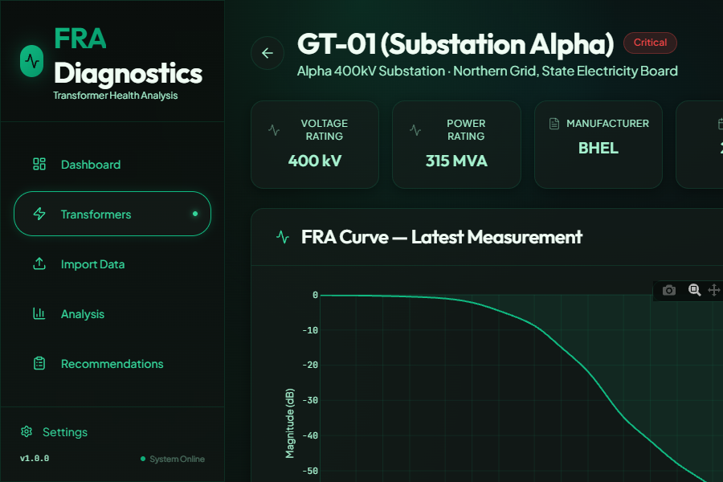

# FRA Diagnostic App

A comprehensive **Frequency Response Analysis (FRA) Diagnostic Application** for transformer health monitoring and fault detection. This application provides ML-powered analysis of FRA measurements to detect winding deformations, core issues, and other transformer faults.



## 🚀 Features

### Core Functionality
- **Transformer Fleet Management** - Register and manage transformer assets with detailed specifications
- **FRA Data Import** - Upload and parse FRA measurements from multiple vendor formats (Omicron, Megger, Doble, Generic CSV/XML)
- **Interactive Visualization** - View FRA curves with interactive Plotly charts
- **Measurement History** - Track and compare measurements over time
- **Criticality Assessment** - Classify transformers by criticality level (Critical, Important, Standard)

### ML-Powered Analysis (Phase 4)
- **Fault Detection** - Ensemble ML model combining XGBoost, CNN, and Autoencoder
- **Health Scoring** - Automated health assessment based on FRA signatures
- **Trend Analysis** - Historical health monitoring and degradation trends

### Maintenance Recommendations (Phase 6)
- **AI-Generated Priorities** - Automated maintenance recommendations based on fault analysis
- **Criticality Escalation Matrix** - Prioritization based on asset criticality and fault probability

## 🛠️ Tech Stack

### Backend
- **FastAPI** - Modern Python web framework
- **SQLAlchemy** - ORM with SQLite database
- **Alembic** - Database migrations
- **Pydantic** - Data validation

### Frontend
- **React 18** - UI framework with TypeScript
- **Vite** - Fast build tool
- **Tailwind CSS v4** - Utility-first CSS framework
- **React Router** - Client-side routing
- **Plotly.js** - Interactive charting
- **Lucide React** - Icon library

### ML Pipeline (Phase 3-4)
- **XGBoost** - Gradient boosting classifier
- **TensorFlow/Keras** - CNN and Autoencoder models
- **NumPy/Pandas** - Data processing
- **SciPy** - Signal processing and feature extraction

## 📁 Project Structure

```
FRA-Diagnostic-app/
├── backend/
│   ├── app/
│   │   ├── models/          # SQLAlchemy models
│   │   ├── routers/         # API endpoints
│   │   ├── schemas/         # Pydantic schemas
│   │   ├── services/        # Business logic
│   │   ├── parsers/         # FRA file parsers
│   │   ├── main.py          # FastAPI app
│   │   └── database.py      # DB configuration
│   ├── alembic/             # Database migrations
│   └── requirements.txt
├── frontend/
│   ├── src/
│   │   ├── components/      # React components
│   │   │   └── ui/          # Reusable UI components
│   │   ├── pages/           # Page components
│   │   ├── api.ts           # API client
│   │   ├── types.ts         # TypeScript types
│   │   └── index.css        # Global styles
│   ├── public/
│   │   └── design-preview.html  # Design system preview
│   └── package.json
├── ml/
│   ├── data_generation/     # Synthetic data generation
│   ├── features/            # Feature extraction
│   ├── models/              # ML model definitions
│   ├── training/            # Training scripts
│   └── saved_models/        # Trained model artifacts
├── data/
│   ├── samples/             # Sample FRA files
│   └── synthetic/           # Generated training data
├── docs/                    # Documentation
└── Plans/                   # Implementation plans
```

## 🚀 Getting Started

### Prerequisites
- Python 3.10+
- Node.js 18+
- npm or yarn

### Backend Setup

```bash
# Navigate to backend directory
cd backend

# Create virtual environment
python -m venv venv

# Activate virtual environment
# Windows:
venv\Scripts\activate
# macOS/Linux:
source venv/bin/activate

# Install dependencies
pip install -r requirements.txt

# Run database migrations
alembic upgrade head

# Seed sample data (optional)
python -m app.seed

# Start the server
uvicorn app.main:app --reload --port 8000
```

### Frontend Setup

```bash
# Navigate to frontend directory
cd frontend

# Install dependencies
npm install

# Start development server
npm run dev
```

The application will be available at:
- **Frontend**: http://localhost:5173
- **Backend API**: http://localhost:8000
- **API Documentation**: http://localhost:8000/docs

## 🎨 Design System

The application uses a **Soft & Elegant Light Theme** with teal/cyan accents, inspired by Apple and Stripe design patterns.

### Color Palette
| Color | Hex | Usage |
|-------|-----|-------|
| Background Primary | `#FAFBFC` | Main background |
| Background Secondary | `#F4F6F8` | Card backgrounds |
| Background Tertiary | `#FFFFFF` | Elevated surfaces |
| Teal 500 | `#14B8A6` | Primary accent |
| Teal 600 | `#0D9488` | Primary accent (dark) |
| Text Primary | `#0F172A` | Headings |
| Text Secondary | `#334155` | Body text |
| Text Muted | `#64748B` | Secondary text |

### Typography
- **Headings**: DM Sans (bold, modern)
- **Body**: Inter (clean, readable)
- **Code**: JetBrains Mono

### Design Preview
View the complete design system at: http://localhost:5173/design-preview.html

## 📊 API Endpoints

### Transformers
- `GET /api/v1/transformers/` - List all transformers
- `POST /api/v1/transformers/` - Create transformer
- `GET /api/v1/transformers/{id}` - Get transformer details
- `PUT /api/v1/transformers/{id}` - Update transformer
- `DELETE /api/v1/transformers/{id}` - Delete transformer

### Measurements
- `GET /api/v1/measurements/` - List measurements
- `GET /api/v1/measurements/{id}` - Get measurement with data
- `GET /api/v1/transformers/{id}/measurements` - Get transformer measurements

### Import
- `POST /api/v1/imports/upload` - Upload FRA file
- `GET /api/v1/imports/history` - Get import history

### Analysis (Phase 4)
- `POST /api/v1/analysis/run/{measurement_id}` - Run fault analysis
- `GET /api/v1/analysis/results/{measurement_id}` - Get analysis results

### Recommendations (Phase 6)
- `GET /api/v1/recommendations/` - Get all recommendations
- `GET /api/v1/recommendations/transformer/{id}` - Get transformer recommendations

## 🔧 Supported FRA File Formats

| Vendor | Extensions | Format |
|--------|------------|--------|
| Omicron | `.fra`, `.csv`, `.xml` | Proprietary + standard |
| Megger FRAX | `.frax`, `.csv`, `.xml` | Proprietary + standard |
| Doble | `.m4000`, `.csv` | Proprietary + standard |
| Generic | `.csv`, `.txt`, `.xml` | Frequency, Magnitude columns |

## 🧪 Detectable Fault Types

| Fault Type | Frequency Range | Indicators |
|------------|-----------------|------------|
| Axial Displacement | 2–20 kHz | Resonance frequency shifts |
| Radial Deformation | < 2 kHz | Low-frequency response changes |
| Core Grounding | < 1 kHz | Inductance pattern anomalies |
| Winding Short Circuit | > 100 kHz | New resonance peaks |
| Loose Clamping | Broadband | Increased damping |
| Moisture Ingress | General | Response degradation |

## 📈 Development Phases

- [x] **Phase 1**: Project setup, database models, basic API
- [x] **Phase 2**: Frontend UI, FRA visualization, data import
- [ ] **Phase 3**: Synthetic data generation, feature extraction
- [ ] **Phase 4**: ML model training (XGBoost, CNN, Autoencoder)
- [ ] **Phase 5**: Trend analysis and historical comparison
- [ ] **Phase 6**: Recommendation engine integration

## 🤝 Contributing

1. Fork the repository
2. Create a feature branch (`git checkout -b feature/amazing-feature`)
3. Commit your changes (`git commit -m 'Add amazing feature'`)
4. Push to the branch (`git push origin feature/amazing-feature`)
5. Open a Pull Request

## 📄 License

This project is licensed under the MIT License - see the [LICENSE](LICENSE) file for details.

## 🙏 Acknowledgments

- FRA analysis methodology based on IEEE C57.149 standard
- Design inspiration from Apple Human Interface Guidelines and Stripe Dashboard
