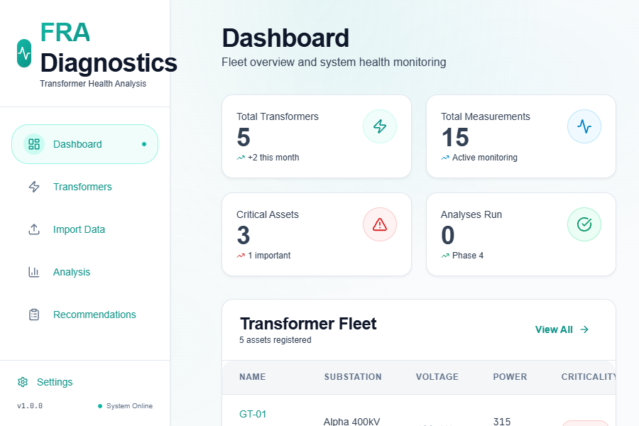

# FRA Diagnostic App

A comprehensive **Frequency Response Analysis (FRA) Diagnostic Application** for transformer health monitoring and fault detection. This application provides ML-powered analysis of FRA measurements to detect winding deformations, core issues, and other transformer faults.



## 🚀 Features

### Core Functionality
- **Transformer Fleet Management** — Register and manage transformer assets with detailed specifications
- **FRA Data Import** — Upload and parse FRA measurements from multiple vendor formats (Omicron, Megger, Doble, Generic CSV/XML)
- **Interactive Visualization** — View FRA curves with interactive Plotly charts, phase overlay, and multi-curve comparison
- **Measurement History** — Track and compare up to 6 measurements simultaneously
- **Criticality Assessment** — Classify transformers by criticality level (Critical, Important, Standard)

### ML-Powered Fault Detection
- **XGBoost Classifier** — Trained on 49 engineered features extracted from FRA signatures (97.97% training accuracy, 96.71% independent evaluation)
- **7-Class Fault Detection** — Axial displacement, radial deformation, core grounding, winding short circuit, loose clamping, moisture ingress, and healthy classification
- **Health Scoring** — 0–100 health score based on fault probability and confidence
- **Feature Importance** — Visualises top contributing features per analysis
- **Fault Probability Dashboard** — Color-coded horizontal bar chart showing all fault class probabilities

### Visualization Engine
- **FRA Curve Analysis** — Interactive Plotly charts with fault-specific frequency band highlighting
- **Phase Overlay** — Toggle secondary Y-axis showing phase response alongside magnitude
- **Multi-Curve Comparison** — Select up to 6 measurements and overlay them with distinct colors
- **Health Score Trend** — Historical Plotly spline chart with threshold lines at 80% (good) and 40% (critical)
- **Fleet Dashboard** — Real-time summary cards, recent analyses, system health ring, and quick actions

### Maintenance Recommendations
- **Auto-Generated Recommendations** — Created from ML analysis results with urgency levels
- **Urgency/Status Filtering** — Filter by urgency (urgent/high/medium/low/info) and status (pending/in-progress/completed/deferred/cancelled)
- **Status Management** — Start, complete, or defer recommendations from the UI
- **Criticality Matrix** — Prioritisation table based on asset criticality and fault probability

### Reporting & Export
- **PDF Reports** — Professional transformer analysis reports with transformer details, ML results, fault probability breakdowns, recommendations, and measurement history
- **Excel Export** — Measurements and analysis results exportable to `.xlsx` with styled headers and auto-width columns
- **Per-Transformer Filtering** — Export data scoped to individual transformers

## 🛠️ Tech Stack

### Backend
- **FastAPI 0.115** — Modern async Python web framework
- **SQLAlchemy 2.0** — ORM with SQLite database
- **Alembic** — Database migrations
- **Pydantic 2.10** — Data validation and serialization
- **ReportLab 4.2** — PDF report generation
- **openpyxl 3.1** — Excel file generation

### Frontend
- **React 18** — UI framework with TypeScript
- **Vite** — Fast build tool
- **Tailwind CSS v4** — Utility-first CSS framework (CSS-first config)
- **React Router v7** — Client-side routing
- **Plotly.js (react-plotly.js)** — Interactive charting
- **Lucide React** — Icon library
- **Axios** — HTTP client

### ML Pipeline
- **XGBoost 3.2** — Gradient boosting classifier
- **scikit-learn 1.8** — Feature scaling, label encoding, train/test split
- **NumPy / SciPy** — Signal processing and feature extraction
- **Pandas** — Data processing
- **joblib** — Model serialization

## 📁 Project Structure

```
FRA-Diagnostic-app/
├── backend/
│   ├── app/
│   │   ├── models/          # SQLAlchemy models (transformer, measurement, analysis, recommendation)
│   │   ├── routers/         # API endpoints (transformers, measurements, analysis, recommendations, imports, reports)
│   │   ├── schemas/         # Pydantic request/response schemas
│   │   ├── services/        # Business logic (normalization, validation, ML inference)
│   │   ├── parsers/         # FRA file parsers (Omicron, Megger, Doble, CSV, XML)
│   │   ├── main.py          # FastAPI application entry point
│   │   ├── config.py        # Application configuration
│   │   └── database.py      # DB connection and session management
│   ├── alembic/             # Database migrations
│   ├── uploads/             # Uploaded FRA files (gitignored)
│   └── requirements.txt
├── frontend/
│   ├── src/
│   │   ├── components/      # React components
│   │   │   ├── Layout.tsx   # App layout with sidebar
│   │   │   ├── Sidebar.tsx  # Navigation sidebar
│   │   │   └── ui/          # Reusable UI components (GlassCard, Badge, Button, Input, Spinner, etc.)
│   │   ├── pages/           # Page components
│   │   │   ├── Dashboard.tsx           # Fleet overview with health trend chart
│   │   │   ├── TransformersPage.tsx    # Transformer list/create
│   │   │   ├── TransformerDetail.tsx   # Detail view with multi-curve comparison
│   │   │   ├── AnalysisPage.tsx        # ML analysis with probability dashboard
│   │   │   ├── RecommendationsPage.tsx # Recommendation management
│   │   │   └── ImportPage.tsx          # FRA file upload
│   │   ├── api.ts           # Axios API client with all endpoints
│   │   ├── types.ts         # TypeScript type definitions
│   │   └── index.css        # Global styles and design system variables
│   ├── public/
│   │   └── design-preview.html  # Design system preview page
│   └── package.json
├── ml/
│   ├── data_generation/     # Synthetic FRA data generation (7 fault classes)
│   ├── features/            # 49-feature extraction (statistical, resonance, band energy, phase)
│   ├── models/              # ML model definitions
│   ├── training/            # XGBoost training with hyperparameter tuning
│   ├── evaluation/          # Cross-validation and metrics reporting
│   ├── saved_models/        # Trained model artifacts (JSON metadata tracked, .joblib gitignored)
│   └── train_and_evaluate.py  # End-to-end training and evaluation script
├── data/
│   ├── samples/             # Sample FRA files (Omicron CSV, Generic CSV/XML)
│   └── synthetic/           # Generated training data
├── docs/                    # Documentation
└── Plans/                   # Implementation plans
```

## 🚀 Getting Started

### Prerequisites
- Python 3.10+
- Node.js 20.19+
- npm

### Backend Setup

```bash
# From project root
python -m venv .venv

# Activate virtual environment
# Windows:
.venv\Scripts\activate
# macOS/Linux:
source .venv/bin/activate

# Install dependencies
pip install -r backend/requirements.txt

# Seed sample data (optional)
cd backend
python -m app.seed

# Start the server
uvicorn app.main:app --reload --port 8000
```

### Frontend Setup

```bash
# Navigate to frontend directory
cd frontend

# Install dependencies
npm install

# Start development server
npm run dev
```

### ML Model Training (optional — pre-trained model included as metadata)

```bash
# From project root, with virtualenv activated
python ml/train_and_evaluate.py --no-tune --n-healthy 2000 --n-per-fault 200
```

This generates synthetic FRA data, extracts 49 features, trains an XGBoost classifier, and saves the model to `ml/saved_models/`.

The application will be available at:
- **Frontend**: http://localhost:5173
- **Backend API**: http://localhost:8000
- **API Documentation**: http://localhost:8000/docs

## 🎨 Design System

The application uses a **Soft & Elegant Light Theme** with teal/cyan accents, inspired by Apple and Stripe design patterns.

### Color Palette
| Color | Hex | Usage |
|-------|-----|-------|
| Background Primary | `#FAFBFC` | Main background |
| Background Secondary | `#F4F6F8` | Card backgrounds |
| Background Tertiary | `#FFFFFF` | Elevated surfaces |
| Teal 500 | `#14B8A6` | Primary accent |
| Teal 600 | `#0D9488` | Primary accent (dark) |
| Text Primary | `#0F172A` | Headings |
| Text Secondary | `#334155` | Body text |
| Text Muted | `#64748B` | Secondary text |

### Typography
- **Headings**: DM Sans (bold, modern)
- **Body**: Inter (clean, readable)
- **Code**: JetBrains Mono

### Design Preview
View the complete design system at: http://localhost:5173/design-preview.html

## 📊 API Endpoints

### Transformers
| Method | Endpoint | Description |
|--------|----------|-------------|
| `GET` | `/api/v1/transformers/` | List all transformers |
| `POST` | `/api/v1/transformers/` | Create transformer |
| `GET` | `/api/v1/transformers/{id}` | Get transformer details |
| `PUT` | `/api/v1/transformers/{id}` | Update transformer |
| `DELETE` | `/api/v1/transformers/{id}` | Delete transformer |

### Measurements
| Method | Endpoint | Description |
|--------|----------|-------------|
| `GET` | `/api/v1/measurements/` | List measurements |
| `GET` | `/api/v1/measurements/{id}` | Get measurement with data |
| `GET` | `/api/v1/transformers/{id}/measurements` | Get transformer measurements |

### Import
| Method | Endpoint | Description |
|--------|----------|-------------|
| `POST` | `/api/v1/imports/upload` | Upload FRA file |
| `GET` | `/api/v1/imports/history` | Get import history |
| `GET` | `/api/v1/imports/stats` | Get import statistics |

### ML Analysis
| Method | Endpoint | Description |
|--------|----------|-------------|
| `POST` | `/api/v1/analysis/run/{measurement_id}` | Run ML fault analysis |
| `GET` | `/api/v1/analysis/results/{measurement_id}` | Get analysis results |
| `GET` | `/api/v1/analysis/list` | List all analyses |

### Recommendations
| Method | Endpoint | Description |
|--------|----------|-------------|
| `GET` | `/api/v1/recommendations/` | List recommendations (with filters) |
| `GET` | `/api/v1/recommendations/transformer/{id}` | Get transformer recommendations |
| `PUT` | `/api/v1/recommendations/{id}/status` | Update recommendation status |

### Reports & Export
| Method | Endpoint | Description |
|--------|----------|-------------|
| `GET` | `/api/v1/reports/generate/{transformer_id}` | Generate PDF analysis report |
| `GET` | `/api/v1/reports/export/measurements` | Export measurements to Excel |
| `GET` | `/api/v1/reports/export/analyses` | Export analyses to Excel |

## 🔧 Supported FRA File Formats

| Vendor | Extensions | Format |
|--------|------------|--------|
| Omicron | `.csv`, `.xml` | Vendor-specific + standard |
| Megger FRAX | `.csv`, `.xml` | Vendor-specific + standard |
| Doble | `.csv` | Vendor-specific + standard |
| Generic | `.csv`, `.txt`, `.xml` | Frequency, Magnitude columns |

## 🧪 ML Fault Detection Details

### Feature Engineering (49 features)
| Category | Count | Examples |
|----------|-------|---------|
| Statistical | 8 | Mean, std, skewness, kurtosis, energy |
| Resonance Peak | 25 | Peak frequencies, magnitudes, Q-factors, bandwidth |
| Band Energy | 9 | Low/mid/high-band mean, std, energy |
| Phase | 5 | Mean, std, skewness, mag-phase correlation |
| Global | 2 | Total peaks, frequency range |

### Detectable Fault Types
| Fault Type | Frequency Range | Indicators |
|------------|-----------------|------------|
| Axial Displacement | 2–20 kHz | Resonance frequency shifts |
| Radial Deformation | < 2 kHz | Low-frequency response changes |
| Core Grounding | < 1 kHz | Inductance pattern anomalies |
| Winding Short Circuit | > 100 kHz | New resonance peaks |
| Loose Clamping | Broadband | Increased damping |
| Moisture Ingress | General | Response degradation |
| Healthy | N/A | Normal FRA signature |

### Model Performance
| Metric | Value |
|--------|-------|
| Training Accuracy | 97.97% |
| Independent Eval Accuracy | 96.71% |
| Mean AUC-ROC (OvR) | 99.76% |
| Model Type | XGBoost |
| Model Version | v1.0.0 |

## 📈 Implementation Progress

- [x] **Phase 1**: Database models, core API, transformer/measurement CRUD
- [x] **Phase 2**: Frontend UI, design system, FRA visualization, multi-vendor data import
- [x] **Phase 3**: ML pipeline — synthetic data generation, 49-feature extraction, XGBoost training & evaluation
- [x] **Phase 4**: Visualization engine — analysis dashboard, health trends, multi-curve comparison, phase overlay
- [x] **Phase 5**: Recommendation engine — auto-generation, urgency classification, status management
- [x] **Phase 6**: Reporting — PDF reports, Excel export, per-transformer filtering
- [ ] **Phase 7**: Security hardening, authentication, role-based access control
- [ ] **Phase 8**: Production deployment, performance optimization, monitoring

## 🤝 Contributing

1. Fork the repository
2. Create a feature branch (`git checkout -b feature/amazing-feature`)
3. Commit your changes (`git commit -m 'Add amazing feature'`)
4. Push to the branch (`git push origin feature/amazing-feature`)
5. Open a Pull Request

## 📄 License

This project is licensed under the MIT License - see the [LICENSE](LICENSE) file for details.

## 🙏 Acknowledgments

- FRA analysis methodology based on IEEE C57.149 standard
- Design inspiration from Apple Human Interface Guidelines and Stripe Dashboard
